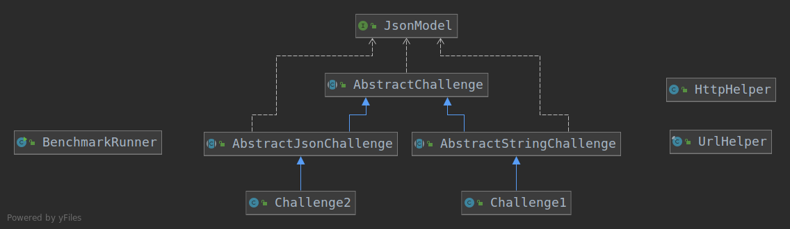

# MorpheusCodingChallenges

This Java-Maven project let's you focus on solving the [coding challenges by Morpheus Tutorials]("https://cc.the-morpheus.de/") 
without having to worry how to benchmark or sending the http requests.<br> 
This is achieved by creating an abstract class that takes care of that so that only one method 
(the one that should actually implements the algorithm that solves the challenge) has to be overwritten.

## HowTo use / solve a new challenge 
1. Create a new class in the package `challenges` 
(recommended naming convention: `Challenge<challengeNumber>`, e.g. `Challenge1`)
2. Extend either `AbstractJsonChallenge` or `AbstractStringChallenge` (depending on whether the GET 
response from the server is a plain text (String) or JSON format)
3. Implement the constructor and call the constructor of the super class as follows:
    - `AbstractJsonChallenge`: 
    `super(<class of the first generic type>, <challengeNumber>)`, e.g. `super(JsonArrayInt.class, 1)` 
    - `AbstractStringChallenge`: 
    `super(<challengeNumber>)`, e.g. `super(1)`
4. Implement the `solveChallenge` method

## Implementation

### Description

- <b>Goal</b>: being able to implement a challenge class that has only one method which solves the challenge -> 
not having to write the same methods over and over again that are responsible for sending the http requests.
- <b>Solution</b>: abstract classes that handle sending the http requests and hold one abstract method called
 "solveChallenge" that has to be implemented in the subclasses.
 
### Architecture



- #### `Benchmarkrunner`
    Entry point that calls the main method from jhm and with that starts running the benchmarks.

- #### `AbstractChallenge`
    Handles the challenge process:
    1. receiving challenge data through GET Request (incl. json parsing if necessary)
    2. solving the challenge (abstract method)
    3. sending solution as POST request (incl. json parsing)
    (`AbstractJsonChallenge` and `AbstractStringChallenge` define in which format the GET response from the 
     server comes)

- #### `HttpHelper` and `UrlHelper`
    Helper classes that hold static methods such as getters for the server urls and sending the requests. 

- #### `JsonModel`
    Interface that's used for the generic type of `AbstractChallenge` where this type has to represent a 
    json model class. It's implementations can be found in the same package (com.lenahartmann00.morpheus_challenges.logic.gson) 


### Package structure
```
com.lenahartmann00.morpheus_challenges
|__ challenges (specific challenges)
|__ logic
    |__ challenge (abstract challenges)
    |__ gson (json model classes)
    |__ helper (helper classes)
|__ BenchmarkRunner.class (main method)
```
   